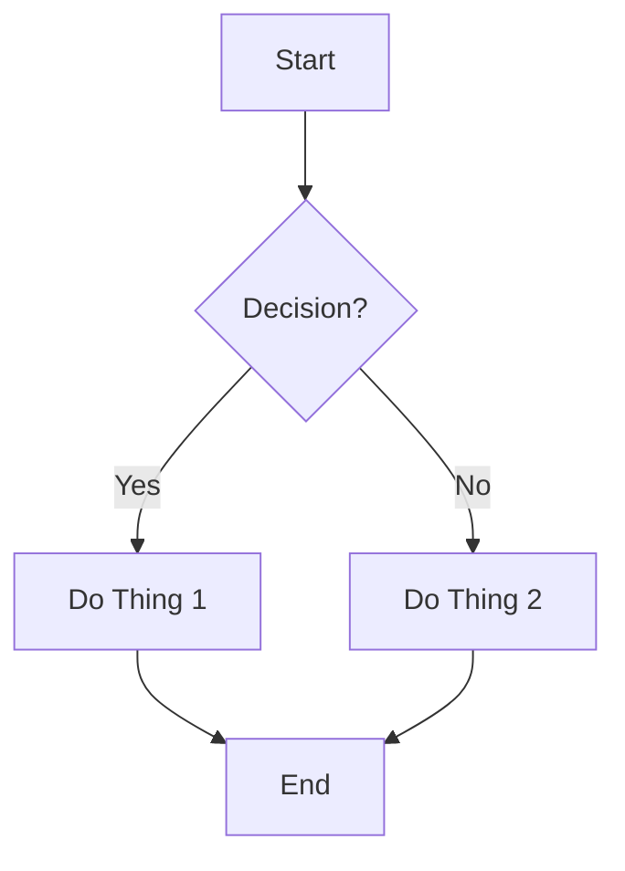

# 🌌 PROTOCOL-X

### Transforming Inputs into Outputs  
_"Structure. Style. Substance."_

---

> **🚀 TL;DR**  
> This template shows **every major Markdown element** in action—and highlights how our free, universal Markdown-to-PDF converter transforms your notes, ChatGPT responses, and documentation into **beautiful, device-agnostic PDFs** that look great on phones, tablets, and desktops alike.

---

## 📑 Table of Contents
1. [Abstract](#abstract)  
2. [Context & Motivation](#1-context--motivation)  
3. [Design & Implementation](#2-design--implementation)  
4. [Feature Showcase](#3-feature-showcase)  
   1. [Text Formatting](#31-text-formatting)  
   2. [Lists](#32-lists)  
   3. [Tables](#33-tables)  
   4. [Code Blocks](#34-code-blocks)  
   5. [Blockquotes & Alerts](#35-blockquotes--alerts)  
   6. [Images & Figures](#36-images--figures)  
5. [Example Diagram](#4-example-diagram)  
6. [Conclusion](#5-conclusion)  
7. [References](#6-references)  
8. [Footnotes](#7-footnotes)  

---

## Abstract

Our **free** Markdown-to-PDF converter lets you take any Markdown file—including ChatGPT outputs—and turn it into a **pixel-perfect PDF** that:

- Retains all formatting (headings, lists, tables, code, images, footnotes…)  
- Scales flawlessly on **phones, tablets, and desktops**  
- Requires no proprietary software or licenses  

Whether you’re sharing with colleagues, publishing a report, or archiving notes, you’ll avoid the common pitfalls of Google Docs pastes and get **consistently beautiful results** every time.

---

## 1. Context & Motivation

Anyone who’s copied Markdown into Google Docs knows the frustration: heading styles break, code blocks lose indentation, tables won’t align, and you end up chasing formatting for longer than you spent writing.  

> **Pain Point:** You ask ChatGPT for a technical summary, paste it into Docs, and suddenly your carefully crafted **`inline code`**, **bullet lists**, and **nested blockquotes** look mangled.

**Solution:** Our converter reads your raw Markdown and outputs a **PDF** that preserves every element exactly as intended—no more manual fixes, no more formatting headaches.

---

## 2. Design & Implementation

We organized this document with clear, numbered sections and a hyperlinked Table of Contents so that **Pandoc**, **markdown-pdf**, or any Markdown engine can generate a crisp PDF. The same process applies to **any** Markdown source—blog drafts, lecture notes, meeting recaps, or ChatGPT transcripts.

---

## 3. Feature Showcase

### 3.1 Text Formatting

You can apply **bold**, *italic*, ~~strikethrough~~, and `inline code` seamlessly:

> **Note:** Combine styles for emphasis, e.g., ***bold italic***.

### 3.2 Lists

#### 3.2.1 Unordered List

- Item A  
  - Subitem A.1  
    - ✔️ Task list item  
    - ✖️ ~~Completed task~~

#### 3.2.2 Ordered List

1. First step  
2. Second step  
   1. Nested step  
   2. Another nested step  
3. Final step

### 3.3 Tables

| Feature         | Supported | Notes                           |
| --------------- | --------- | ------------------------------- |
| Headings        | ✅        | Levels 1–6                      |
| Lists           | ✅        | Ordered, unordered, task lists  |
| Tables          | ✅        | Pipe-separated                  |
| Code Blocks     | ✅        | Fenced with backticks           |
| Blockquotes     | ✅        | Single and multi-line           |
| Footnotes       | ✅        | GitHub and Pandoc style         |
| Images & Links  | ✅        | Inline and reference style      |

### 3.4 Code Blocks

```python
def greet(name: str) -> None:
    """
    Prints a greeting.
    """
    print(f"Hello, {name}!")

if __name__ == "__main__":
    greet("World")
```

```bash
# Shell example
$ mkdir project-x
$ cd project-x
$ touch README.md
```

### 3.5 Blockquotes & Alerts

> **Warning:** Ensure your converter supports all extensions you plan to use!  
>
> > Nested blockquotes are also supported.

> **Tip:** Use horizontal rules for section breaks.  
> —————

### 3.6 Images & Figures

  
*Figure 1: A placeholder landscape.*

**Figure 2:** Urban skyline.  


---

## 4. Example Diagram



---

## 5. Conclusion

With our converter, you get a **streamlined**, **professional** PDF output from any Markdown source—no subscriptions, no hidden fees, and no compatibility headaches. Perfect for:

- Sharing ChatGPT outputs with non-technical friends  
- Distributing polished meeting minutes  
- Publishing whitepapers, tutorials, and technical docs  

Give it a try and transform your Markdown into **presentation-ready PDFs** in seconds.

---

## 6. References

1. Pandoc Official Guide: <https://pandoc.org/MANUAL.html>  
2. GitHub Flavored Markdown: <https://github.github.com/gfm/>

---

## 7. Footnotes

This sentence has a footnote.[^1]  
This sentence has a footnote.[^2]  
This sentence has a footnote.[^3]  

[^1]: Demonstrates footnote styling in Markdown.  
[^2]: Shows how multiple footnotes render.  
[^3]: Footnotes are fully supported in the PDF output.  
