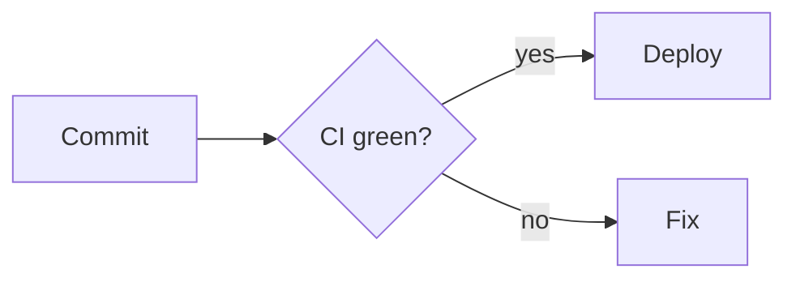

<!-- Generated from src/lib/mcp/guide.js (v1.4.0) by scripts/build-skill.mjs — do not edit by hand. -->

## Tooling

Markdown Studio exposes a remote MCP server at `https://md.dima.ua/api/mcp` (Streamable HTTP, no auth by default). If it is connected, prefer its tools over guessing:

| Tool | Use it to |
| --- | --- |
| `get_markdown_guide` | Read the full authoring guide **and** every tool/settings argument (same content as below) |
| `list_templates` / `get_template` | Start from a proven structure with matching design settings |
| `list_design_options` | JSON of every valid `settings` value (themes, fonts, paper, …) — relay these when the user wants a nice PDF |
| `import_web_page` | Turn a public URL into clean Markdown + metadata + analysis (`url`, `format`, `stripImages`, `stripLinks`) |
| `analyze_markdown` | Lint before rendering; fix every warning it reports |
| `render_html` | Quick standalone HTML preview (`markdown`, `settings`, `assets`, `fileName`) |
| `render_pdf` | Final PDF as a base64 `application/pdf` resource (same arguments as `render_html`). Save it and open it inline right away — in Cursor, a canvas embedding the PDF — never in an external viewer |

Prompts: `write_document`, `polish_markdown`, `make_pdf` (walk through every design argument, then render), `pdf_from_url` (import a page, clean it up, render).

Without the MCP server you can still POST `{"markdown","settings","fileName"}` to `https://md.dima.ua/api/convert` and save the PDF response body, and `GET https://md.dima.ua/api/scrape?url=…` to import a web page as Markdown.

To connect the MCP server in Cursor add to `.cursor/mcp.json`:

```json
{ "mcpServers": { "markdown-studio": { "url": "https://md.dima.ua/api/mcp" } } }
```

In Claude Code: `claude mcp add --transport http markdown-studio https://md.dima.ua/api/mcp`

---

# Writing Markdown for Markdown Studio

Markdown Studio renders GitHub-flavoured Markdown into print-ready PDFs (and standalone HTML).
Everything below renders correctly. Anything not listed here (LaTeX math, HTML layouts, YAML
front-matter, custom CSS) does **not**.

## Workflow

1. Read this guide once (you are doing that now).
2. Pick a starting point: `list_templates` → `get_template` gives you proven structure **and** matching design settings for reports, proposals, READMEs, meeting notes, invoices and résumés. If the source is a web page, call `import_web_page` with the URL instead — it returns clean Markdown, metadata and an analysis; never retype page content from memory.
3. Write the Markdown. One `#` title, `##` sections, short paragraphs, generous use of tables, callouts and code blocks.
4. Run `analyze_markdown` — it returns the outline plus warnings (skipped heading levels, code fences without a language, YAML front-matter, missing images, ragged tables…). Fix everything it reports.
5. If the user asked for a nice PDF, tell them the design knobs (theme, paper, TOC, cover, header/footer, fonts) and agree a `settings` object — the full argument list is at the end of this guide.
6. Render with `render_pdf` (or `render_html` for a quick look). Pass `markdown`, `settings`, optional `assets` and `fileName`.
7. **Open the PDF immediately** — save it, then show it inside the client's own inline surface (in Cursor: a canvas that embeds the PDF), never in an external viewer or browser, and without asking first. See *After rendering: open the PDF immediately* at the end of this guide.

## Document structure

- Exactly **one** `# H1` at the very top — it becomes the document title, the PDF file name, the `{title}` placeholder in headers/footers and the cover title.
- Use `##` for sections and `###` for sub-sections. Never skip a level (`##` → `####`). `####`–`######` exist but rarely help in print.
- Open with a one-paragraph summary right under the title (or a `> [!IMPORTANT]` callout for the key takeaway).
- Keep paragraphs to 2–4 sentences. Prefer a list or table over a paragraph that enumerates things.
- Do **not** write your own table of contents — enable `settings.toc` and it is generated from `##`/`###` headings with correct page anchors.
- Do **not** number headings by hand ("2.1 Scope") — enable `settings.headingNumbers`.
- Don't hard-wrap lines at 80 columns; one paragraph = one line. A single trailing double-space (or a backslash) forces a line break; otherwise a blank line separates paragraphs.
- Separate every block (heading, list, table, code fence, quote) from its neighbours with a blank line.

## Supported syntax

### Inline

`**bold**`, `*italic*`, `***both***`, `~~strikethrough~~`, `` `inline code` ``, `[link text](https://example.com)`, `<https://bare.url>`, footnote refs `[^1]`.
Inline HTML `<kbd>Ctrl</kbd>+<kbd>S</kbd>`, `<mark>highlight</mark>`, `<sup>2</sup>`, `<sub>i</sub>` and `<br>` are styled. Emoji (`:tada:` is **not** supported — paste the actual character 🎉) render as consistent colour glyphs.

### Lists

```md
- Item
  - Nested item (indent two spaces)
1. Ordered
2. Ordered
   1. Nested ordered
- [ ] Open task
- [x] Done task (rendered with a check box and struck through)
```

Lists may contain paragraphs, code blocks and tables when indented to the item's text column.

### Tables

Tables get striped rows and a coloured header. Compact tables stay together; longer tables split between rows and repeat their header.

```md
| Metric | Q2 | Q3 | Change |
| --- | ---: | ---: | ---: |
| ARR | $12.4M | $14.6M | **+18%** |
```

- Right-align numbers with `---:`, centre with `:---:`.
- Keep to ≤ 6 columns on portrait paper (≤ 9 on landscape); split wider data into several tables.
- Every row must have the same number of cells as the header. Escape literal pipes as `\|`.
- A table with an empty header (`|  |  |`) is fine for key–value blocks (e.g. invoice "From / To").

### Code

````md
```ts title="src/greet.ts"
export const greet = (name: string) => `Hello, ${name}!`;
```
````

- Always give fences a language (`ts`, `js`, `python`, `bash`, `json`, `yaml`, `sql`, `go`, `rust`, `java`, `csharp`, `html`, `css`, `diff`, `text`, …). Use `text` for plain output.
- `title="…"` (or the shorthand ```js:app.js) adds a file-name tab above the block.
- Blocks up to ~28 lines are kept on one page; longer blocks flow across pages. Prefer several short blocks over one huge one.
- Use `~~~` or four back-ticks to fence Markdown that itself contains ```.

### Callouts

```md
> [!NOTE]
> Neutral information.

> [!TIP]
> A helpful hint.

> [!IMPORTANT]
> The key takeaway — use for executive-summary style highlights.

> [!WARNING]
> Something that can go wrong.

> [!CAUTION]
> Irreversible or dangerous.
```

Plain `> quotes` render as an accent-bordered blockquote; nested `> >` quotes are supported.

### Images and figures

```md

*Figure 1 — an optional caption on the very next line becomes a real figure caption*

      ← width 160 px, height automatic

```

- A standalone image paragraph is rendered as a centred `<figure>`; the `*italic*` line right after it is the caption.
- Remote images must be publicly reachable over HTTPS; the renderer waits for them but gives up after a while. For anything you generate locally, pass it in `assets` as a data URL and reference it as `asset:<name>`.
- Images are limited to the text width; use `=WIDTHx` to make them smaller. Don't embed screenshots wider than ~1600 px.

### Diagrams (Mermaid)

````md

````

`flowchart`, `sequenceDiagram`, `gantt`, `classDiagram`, `stateDiagram-v2`, `erDiagram`, `pie`, `xychart-beta`, `timeline` and `mindmap` all work. Keep diagrams under ~20 nodes so they stay legible on paper. The optional `title` becomes a caption.

### Footnotes

```md
Revenue grew 18%.[^src]

[^src]: Internal finance report, Q3 2026.
```

Footnotes are collected under a "Footnotes" divider at the end of the document.

### Page breaks

Put `\pagebreak` (or `<!-- pagebreak -->`) on its own line, surrounded by blank lines, to force a new page. Or set `settings.pageBreaks` to `"h1"` / `"h2"` for automatic breaks before every H1 / H1+H2.

Use `settings.pageBreaks: "auto"` by default. Pagination uses the rendered size, including fonts, paper, margins, images and running headers/footers:
- Headings stay with their opening content. Up to two short introductory paragraphs (each at most three rendered lines) stay with the heading.
- A heading, introduction and following table/list/figure/code block stay together when that opening fits within half a usable page. Compact tables up to 40% of a usable page also stay intact on their own.
- For longer tables, the heading and short introduction stay with the table header and first two body rows when that opening fits within half a page. The remaining rows can flow onto later pages with repeated headers. Exceptionally tall rows/blocks may need to split.
- Paragraphs avoid leaving fewer than three lines on either side of a page break. A divider immediately before a heading stays with that heading.
- There is no rule that every heading below the halfway point must move: keep it on the current page when a useful opening fits. Avoid forcing every small subsection onto a fresh page.

For an intentional section boundary, put the marker **before the heading**, never between its introduction and table:

```md
End of the previous section.

\pagebreak

## Pay

All amounts are in USD per month.

| Item | Amount |
| --- | ---: |
| Base pay | 1,500 |
```

The marker is invisible in the PDF; the editor toolbar's **Page break** button inserts it. `\newpage`, `<!-- page-break -->`, `<!-- newpage -->` and `---pagebreak---` are aliases. Markers inside code examples are literal text. `---` is a visual divider, not a page break.

After rendering, inspect the actual PDF page transitions. If a section needs an editorial break, insert the marker before its heading and render again. Do not guess page positions from Markdown line counts or pad with blank lines. Recheck manual breaks after changing paper, fonts, margins or content. `analyze_markdown` checks syntax, not physical page layout; the live preview estimates long-block splits, while the PDF is authoritative.

### Horizontal rule

`---` on its own line (with blank lines around it — directly under a text line it turns that line into a heading).

## Design settings

Pass a `settings` object to `render_pdf` / `render_html`. Every key is optional. The complete argument list (tools, nested `settings` fields, enums, defaults, prompts) is in **Relaying options to the user** below — use that list when explaining choices to a person. `list_design_options` returns the same enums as JSON.

```json
{
  "theme": "corporate",
  "font": "inherit",
  "headingFont": "inherit",
  "fontSize": "md",
  "accentColor": "#0F4C81",
  "paperSize": "A4",
  "orientation": "portrait",
  "margins": "normal",
  "background": "none",
  "pageBreaks": "h1",
  "toc": true,
  "headingNumbers": true,
  "justify": false,
  "header": { "text": "{title}", "showDate": true },
  "footer": { "text": "Confidential", "pageNumbers": true, "pageNumberStyle": "n-of-total" },
  "cover": { "enabled": true, "title": "", "subtitle": "Quarterly review", "author": "Strategy team", "date": "Q3 2026", "showLogo": true },
  "logo": { "dataUrl": "data:image/png;base64,…", "position": "title-right", "size": "md" }
}
```

### Choosing a theme

| Theme | Feel | Good for |
| --- | --- | --- |
| `clean` | Neutral sans-serif, blue accent | READMEs, docs, general |
| `corporate` | Navy headings, white-on-navy table headers | Business reports, decks-as-docs |
| `editorial` | Serif body, warm paper, Playfair headings | Proposals, essays, long-form |
| `forest` | Calm greens, Lora serif | Meeting notes, internal memos |
| `mono` | Pure black & white, Space Grotesk | Invoices, specs, anything to be printed in B/W |
| `midnight` | Dark slate page, light text | Screen-only PDFs, slides-like handouts |

Every nested field, enum, default and tool argument is listed at the end of this guide.

## Recipes

- **Branded running header** — set `logo.position: "page-header"`, `logo.dataUrl`, `logo.aspect` (image width / height), and `header.text` together. The logo and text are vertically centered with an 8px gap; logo-only and text-only headers have no extra gap. Header logos are 14px tall with width capped at 160px; `logo.size` applies to title placements. `header.showDate` adds the date on the right. Do not imitate a running header with a Markdown image or spaces.
- **Business report** — `corporate`, `toc`, `headingNumbers`, `cover.enabled`, `header.text: "{title}"`, `footer.text: "Confidential"`, `pageBreaks: "h1"`. Start with an *Executive summary* and a KPI table.
- **Proposal / statement of work** — `editorial`, cover off, header `"Proposal — {title}"`; sections Overview → Objectives → Scope (phases as `###`) → Timeline (mermaid `gantt`) → Investment table → Acceptance table with signature rows.
- **README / technical doc** — `clean`, `toc`; titled code blocks, an options table (`Option | Type | Default | Description`), `> [!WARNING]` for gotchas.
- **Meeting notes** — `forest`, `header.showDate`; Attendees line, Agenda (ordered list), Discussion (`###` per item), Decisions (✅/⏸ bullets), Action items (task list with **Owner** in bold and a due date).
- **Invoice** — `mono`, page numbers off, footer "Thank you for your business."; key–value table for From/To/Dates, items table with right-aligned amounts, totals table, payment details.
- **Résumé / CV** — `clean`, `fontSize: "sm"`, `margins: "narrow"`, page numbers off; name as H1, one-line contact row, `##` per section, `###` per role with an `*italic*` dates line.
- **Web page / article** — `import_web_page` first; `editorial` for long-form, `clean` + `toc` for docs; `header.text` = site name, page numbers on; keep the page title as the single H1, remove leftover "share"/"related" fragments, close with a *Source: <url>* footnote.

## Anti-patterns (these render badly)

- YAML front-matter (`---\ntitle: …\n---`) — turns into a horizontal rule and a stray heading. Put the title in `# H1` instead.
- LaTeX / MathJax (`$x^2$`, `$$…$$`) — printed literally. Write formulas in words or use `<sup>`/`<sub>`.
- Raw HTML for layout (`<table>`, `<div style>`, `<center>`, `<style>`, `<script>`) — unstyled or stripped. Use Markdown tables.
- Hand-written tables of contents or numbered headings when `toc` / `headingNumbers` can do it.
- Multiple `# H1` titles in one document (unless you intend chapter-style sections with `pageBreaks: "h1"`).
- Code fences without a language, or with a language for prose.
- Very wide tables (> 6 columns portrait) or giant images — they get squeezed.
- Hard-wrapped paragraphs and trailing double-spaces used as "formatting" — they create random line breaks.
- Emoji in `header.text` / `footer.text` — running heads use a print font without emoji glyphs.
- Relative image paths (`./img/chart.png`) — the renderer cannot see your file system; use HTTPS URLs or `assets`.

## Relaying options to the user

When someone asks you to make a nice PDF, tell them the knobs they can turn — do not hide them. In plain language, offer:

- **Look** — theme (clean, corporate, editorial, forest, mono, midnight), optional accent colour, body/heading fonts, size (compact / comfortable / large), page background
- **Page** — paper (A4, Letter, Legal), portrait or landscape, margins (narrow / normal / wide)
- **Structure** — table of contents, numbered headings, cover page (title, subtitle, author, date), automatic page breaks
- **Chrome** — running header/footer text, date in the header, page numbers ("3 / 12" or "3"), logo placement
- **File name** — optional; otherwise taken from the H1

Recommend a starting set from the recipes (report → corporate + TOC + cover, README → clean + TOC, invoice → mono, and so on). If they say "just make it look good", apply the matching recipe and mention what you chose.

## After rendering: open the PDF immediately

The moment `render_pdf` returns, show the PDF to the user — automatically, without being asked and without asking "shall I open it?". Never stop at "the PDF is ready" or a bare file path.

1. **Save it.** Decode the base64 resource and write `<fileName>.pdf` next to the source Markdown (or where the user asked) so they keep the file.
2. **Open it inside the client's own inline surface**, never in an external application:
   - **Cursor:** create a canvas — one `<file-name>.canvas.tsx` in `~/.cursor/projects/<workspace>/canvases/` (follow the Cursor canvas skill). Inline the base64 blob from the tool result as a string constant and render it with `<iframe src={"data:application/pdf;base64," + PDF_BASE64} title="<file name>" style={{ width: "100%", height: "100vh", border: 0 }} />` (or `<embed type="application/pdf">`). The canvas must not `fetch()` or read files — the PDF has to be embedded. Keep it minimal: the viewer filling the pane plus a one-line header with the file name, paper size and theme. Link the canvas file in your reply so it opens beside the chat. If the host cannot display PDFs inline, call `render_html` with the same arguments and show that HTML in the same canvas via `<iframe srcDoc={HTML} />` — it uses the same CSS as the PDF.
   - **Claude Desktop, ChatGPT and other clients with an artifact / preview pane:** put the PDF in that inline pane the same way.
   - **No inline surface (plain CLI):** print the saved absolute path and stop.
3. **Do not** launch a system viewer or browser (`open`, `xdg-open`, `start`, Preview, Acrobat, a new browser tab) — the user wants to see the PDF beside the chat, not in another window.
4. After it is open, confirm the file name and the settings you used. When the user asks for changes, re-render and update the **same** canvas so the new PDF replaces the old one in place.

`render_html` output should be shown the same way (canvas + `<iframe srcDoc>`), when the user asked to see it.

## Tool arguments

All tools are stateless. Pass the full Markdown every time.

### `get_markdown_guide`

No arguments. Returns this guide (syntax + every setting).

### `list_design_options`

No arguments. Returns JSON: defaults, themes (colours and default fonts), fonts, sizes, paper, margins, backgrounds, page-break modes, logo placement, and the `{title}` placeholder.

### `list_templates`

No arguments. Returns id, name, description and recommended `settings` for each starter.

### `get_template`

| Argument | Required | Meaning |
| --- | --- | --- |
| `id` | yes | Template id: "blank", "welcome", "report", "proposal", "readme", "meeting", "invoice", "resume". |

| Id | Name | Description |
| --- | --- | --- |
| `blank` | Blank | Start from an empty page. |
| `welcome` | Feature tour | Every supported Markdown feature in one document. |
| `report` | Business report | Cover page, contents, numbered sections. |
| `proposal` | Project proposal | Scope, timeline, budget and acceptance. |
| `readme` | Project README | Installation, usage, API and contributing. |
| `meeting` | Meeting notes | Agenda, decisions and action items. |
| `invoice` | Invoice | Line items, totals and payment details. |
| `resume` | Résumé | A clean single-column CV. |

Returns the Markdown skeleton and the `settings` it was designed with. Pass those settings through to `render_pdf` unless the user overrides them.

### `analyze_markdown`

| Argument | Required | Meaning |
| --- | --- | --- |
| `markdown` | yes | The full GitHub-flavoured Markdown source (max 2 MB). Always pass the entire document — tools are stateless. |
| `settings` | no | Same object as render. Currently only `settings.toc` changes linting (hand-written TOC vs generated). |
| `assets` | no | Embedded images as a map of name → data URL (`data:image/png;base64,…`, JPEG, SVG, WebP, GIF). Reference in Markdown as ``. Max 24 images, 3 MB each, 8 MB total. Remote HTTPS images can be used in Markdown without this map. |

Fix every `"warning"` before rendering. `"info"` items are suggestions.

### `import_web_page`

Renders a public web page in headless Chromium (5–25 s) — waiting for JavaScript and scrolling so lazy-loaded content appears — removes navigation, ads, banners and sidebars based on the rendered layout, keeps the visible content in reading order and converts it to GitHub-flavoured Markdown (headings, lists, tables, fenced code with language, `> [!NOTE]` callouts, figures, math, absolute links and images). Returns a summary (metadata, stats, warnings), a `structuredContent` object (`url`, `title`, `description`, `siteName`, `author`, `published`, `canonical`, `fileName`, `stats`, `outline`, `warnings`) and the content as an embedded `text/markdown` (or `text/html`) resource.

| Argument | Required | Meaning |
| --- | --- | --- |
| `url` | yes | Public http(s) URL of the page to import (max 2048 chars). "https://" is assumed when the scheme is missing. localhost and private-network hosts are rejected. |
| `format` | no | "markdown" (default) converts the main content to GitHub-flavoured Markdown and runs analyze_markdown on it; "html" returns the cleaned HTML fragment instead. |
| `stripImages` | no | Remove every image from the result. Default false. Use when the page is image-heavy or the images are decorative. |
| `stripLinks` | no | Replace hyperlinks with their text (images are kept). Default false. Handy for print where links are not clickable anyway. |

Use it whenever the user hands you a URL. Then polish the Markdown (fix the reported warnings, delete leftover "share"/"related" fragments, add a source footnote) and pass it to `render_pdf`. Without MCP the same import is `GET /api/scrape?url=…&images=true&links=true` (or `/api/scrapehtml`).

### `render_pdf` / `render_html`

Same arguments. `render_pdf` uses headless Chromium (3–15 s) and returns a base64 `application/pdf` resource. `render_html` is fast and returns standalone HTML with the same CSS. As soon as `render_pdf` returns, save the file and open it inline for the user (Cursor: a canvas embedding the PDF) — see **After rendering** above.

| Argument | Required | Meaning |
| --- | --- | --- |
| `markdown` | yes | The full GitHub-flavoured Markdown source (max 2 MB). Always pass the entire document — tools are stateless. |
| `settings` | no | Document design settings. Every key is optional and merged over the defaults. When a user asks for a nice PDF, present these options (names below) so they can choose, then pass the chosen values here. |
| `assets` | no | Embedded images as a map of name → data URL (`data:image/png;base64,…`, JPEG, SVG, WebP, GIF). Reference in Markdown as ``. Max 24 images, 3 MB each, 8 MB total. Remote HTTPS images can be used in Markdown without this map. |
| `fileName` | no | Preferred output file name without extension (max 120 chars). Defaults to the first H1 / inferred title. Do not include .pdf or .html. |

### `settings` object

Every key is optional. Unknown keys are ignored. Nested objects are merged field-by-field over the defaults.

| Key | Type | Default | Allowed / notes |
| --- | --- | --- | --- |
| `theme` | enum | `clean` | Colour and typography theme. One of "clean", "corporate", "editorial", "forest", "mono", "midnight". Default "clean". |
| `font` | enum | `inherit` | Body font. "inherit" uses the theme default. Otherwise one of "inter", "ibm-plex-sans", "roboto", "space-grotesk", "source-serif", "lora", "merriweather", "playfair". Default "inherit". |
| `headingFont` | enum | `inherit` | Heading font. "inherit" uses the theme default. Otherwise one of "inter", "ibm-plex-sans", "roboto", "space-grotesk", "source-serif", "lora", "merriweather", "playfair". Default "inherit". |
| `fontSize` | enum | `md` | Body size: "sm" = 9.5pt (Compact), "md" = 10.5pt (Comfortable), "lg" = 12pt (Large). Default "md". |
| `accentColor` | hex string | theme accent | Override the theme accent as "#rgb" or "#rrggbb" (e.g. "#0F4C81"). Omit to keep the theme colour. Do not pass an empty string. |
| `paperSize` | enum | `A4` | Page size: "A4" (A4), "Letter" (US Letter), "Legal" (US Legal). Default "A4". |
| `orientation` | enum | `portrait` | "portrait" or "landscape". Default "portrait". Use landscape for wide tables. |
| `margins` | enum | `normal` | Page margins: "narrow" (Narrow), "normal" (Normal), "wide" (Wide). Default "normal". |
| `background` | enum | `none` | Subtle full-page texture: "none" (None), "soft" (Soft tint), "gradient" (Gradient), "dots" (Dots), "grid" (Grid), "lines" (Ruled lines). Default "none". |
| `pageBreaks` | enum | `auto` | Pagination: "auto" (Automatic), "h1" (Before each H1), "h2" (Before each H1 & H2). Default "auto". Auto keeps headings and short introductions with compact tables/blocks, and the opening rows of longer tables. For an editorial break, put \pagebreak on a separate paragraph BEFORE the section heading. Inspect the rendered PDF after layout changes. |
| `toc` | boolean | false | Insert a generated table of contents from ## / ### (after the title, or on its own page when a cover is on). Default false. Do not write a TOC by hand. |
| `headingNumbers` | boolean | false | Auto-number H1–H3 as 1 / 1.1 / 1.1.1. Default false. Do not number headings by hand. |
| `justify` | boolean | false | Justify body paragraphs. Default false. |
| `header` | object | see below | Running header. Partial object is fine. |
| `header.text` | string ≤200 | empty | Running header (max 200 chars). "{title}" is replaced with the document title. Keep short; no emoji. To pair text with a logo on every page, also set logo.position="page-header" and logo.aspect to the image width / height. Logo and text are vertically centered with an 8px gap only when both are present; either may be used alone. |
| `header.showDate` | boolean | false | Show today's date on the right of the header. Default false. |
| `footer` | object | see below | Running footer. Partial object is fine. |
| `footer.text` | string ≤200 | empty | Running footer (max 200 chars). Supports "{title}". Keep short; no emoji. |
| `footer.pageNumbers` | boolean | true | Show page numbers. Default true. |
| `footer.pageNumberStyle` | enum | `n-of-total` | "n-of-total" → "3 / 12", "n" → "3". Default "n-of-total". |
| `cover` | object | see below | Cover page. Partial object is fine. |
| `cover.enabled` | boolean | false | Full cover page before the document. Default false. |
| `cover.title` | string ≤300 | document H1 | Cover title (max 300). Defaults to the document H1 when omitted or empty. |
| `cover.subtitle` | string ≤500 | empty | Cover subtitle (max 500). |
| `cover.author` | string ≤200 | empty | Cover author / prepared-by line (max 200). |
| `cover.date` | string ≤100 | empty | Cover date line (max 100). Any string — not parsed. |
| `cover.showLogo` | boolean | true | Draw the logo on the cover when a logo is set. Default true. |
| `logo` | object or `null` | `null` | Set to `null` to remove a logo. Requires `dataUrl` when present. |
| `logo.dataUrl` | data URL | — | PNG/JPEG/SVG/WebP/GIF as a data URL starting with "data:image/". Required if logo is set. |
| `logo.name` | string ≤200 | `logo` | Optional logo file name (max 200). |
| `logo.position` | enum | `title-right` | Placement: "title-right" (Beside title), "title-above" (Above title), "page-header" (Every page header), "watermark" (Watermark). Default "title-right". |
| `logo.size` | enum | `md` | Height: "sm" (Small, 32px), "md" (Medium, 48px), "lg" (Large, 72px). Default "md". |
| `logo.aspect` | number > 0 | `1` | width / height of the image, used when the logo is drawn in the page header. Optional; default 1. |

#### Themes

| Id | Name | Feel | Accent | Page | Default body / heading font |
| --- | --- | --- | --- | --- | --- |
| `clean` | Clean | Neutral, modern, blue accent | #2563EB | light | `inter` / `inter` |
| `corporate` | Corporate | Navy headings, formal spacing | #0F4C81 | light | `ibm-plex-sans` / `ibm-plex-sans` |
| `editorial` | Editorial | Serif body, warm paper tone | #B45309 | light | `source-serif` / `playfair` |
| `forest` | Forest | Calm greens, soft contrast | #16A34A | light | `lora` / `lora` |
| `mono` | Mono | Black on white, no color | #111111 | light | `space-grotesk` / `space-grotesk` |
| `midnight` | Midnight | Dark slate, light text | #60A5FA | dark | `inter` / `inter` |

#### Fonts

Plus `"inherit"` on `font` / `headingFont` to keep the theme default.

| Id | Name | Kind |
| --- | --- | --- |
| `inter` | Inter | sans |
| `ibm-plex-sans` | IBM Plex Sans | sans |
| `roboto` | Roboto | sans |
| `space-grotesk` | Space Grotesk | sans |
| `source-serif` | Source Serif 4 | serif |
| `lora` | Lora | serif |
| `merriweather` | Merriweather | serif |
| `playfair` | Playfair Display | serif |

#### Font sizes

| Id | Name | Body |
| --- | --- | --- |
| `sm` | Compact | 9.5pt |
| `md` | Comfortable | 10.5pt |
| `lg` | Large | 12pt |

#### Paper

| Id | Name |
| --- | --- |
| `A4` | A4 |
| `Letter` | US Letter |
| `Legal` | US Legal |

#### Margins

| Id | Name |
| --- | --- |
| `narrow` | Narrow |
| `normal` | Normal |
| `wide` | Wide |

#### Backgrounds

| Id | Name |
| --- | --- |
| `none` | None |
| `soft` | Soft tint |
| `gradient` | Gradient |
| `dots` | Dots |
| `grid` | Grid |
| `lines` | Ruled lines |

#### Page breaks

| Id | Name |
| --- | --- |
| `auto` | Automatic |
| `h1` | Before each H1 |
| `h2` | Before each H1 & H2 |

#### Logo position and size

| Id | Name |
| --- | --- |
| `title-right` | Beside title |
| `title-above` | Above title |
| `page-header` | Every page header |
| `watermark` | Watermark |

| Id | Name | Height |
| --- | --- | --- |
| `sm` | Small | 32px |
| `md` | Medium | 48px |
| `lg` | Large | 72px |

Placeholders: `{title}` in `header.text` / `footer.text` becomes the document title (the first H1). Forced page break in Markdown: `\\pagebreak` or `<!-- pagebreak -->` on its own line. Image size hint: `` (either dimension may be omitted, e.g. `=300x`).

### Prompt arguments

**`write_document`**

| Argument | Required | Meaning |
| --- | --- | --- |
| `brief` | yes | What the document is about, who it is for, and any facts to include. |
| `kind` | no | One of `"report"`, `"proposal"`, `"readme"`, `"meeting"`, `"invoice"`, `"resume"`, `"other"`. |

**`polish_markdown`**

| Argument | Required | Meaning |
| --- | --- | --- |
| `markdown` | yes | Existing Markdown to reformat without changing meaning. |

**`make_pdf`**

| Argument | Required | Meaning |
| --- | --- | --- |
| `brief` | no | What to write if there is no Markdown yet. |
| `markdown` | no | Existing Markdown to render. |
| `audience` | no | Who will read it (affects theme and density recommendations). |

**`pdf_from_url`**

| Argument | Required | Meaning |
| --- | --- | --- |
| `url` | yes | The public web page to import. |
| `audience` | no | Who will read the PDF (affects theme and density recommendations). |
| `notes` | no | What to keep, drop or change during clean-up. |

Limits: Markdown ≤ 2 MB; 24 images; 3 MB per image; 8 MB images combined.

